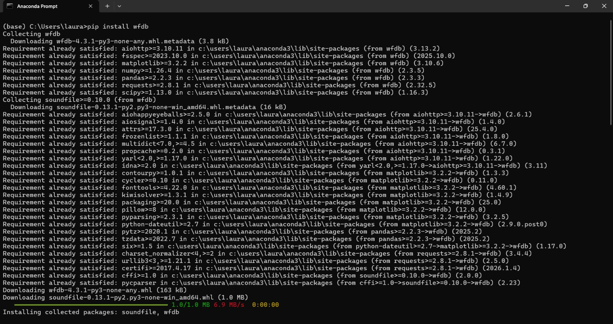
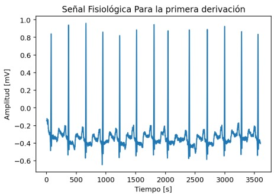

# LABORATORIO-1
## ESTADISTICA
Durante la práctica, vamos acalcular parámetros
estadísticos fundamentales de señales biomédicas reales y sintéticas con el fin
de proporcionar una descripción de esta y establecer posibles relaciones entre
los valores estadísticos obtenidos y el proceso fisiológico subyacente.<br>

### OBJETIVOS:
#### Objetivo General:
Caracterizar una señal biomédica en función de
parámetros estadísticos.
#### Objetivos Específicos
- Identificar las principales magnitudes estadísticas que describen una señal
biomédica.
- Emplear funciones aritméticas y comandos específicos de un entorno de
programación para calcular diferentes parámetros estadísticos de una
señal biomédica.
- Plantear hipótesis desde la fisiología que expliquen los valores estadísticos
obtenidos. 

## PARTE A
En esta primera etapa se procedió a seleccionar y descargar una señal fisiológica desde la plataforma PhysioNet, verificando previamente que su duración fuera suficiente para permitir el cálculo adecuado de los estadísticos solicitados. Posteriormente, la señal fue cargada en el entorno de Python y se emplearon librerías como *matplotlib* para su visualización gráfica. Este proceso constituyó el punto de partida del estudio estadístico, apoyándose en herramientas computacionales que permiten caracterizar de manera precisa las principales propiedades de la señal analizada.
### CÓDIGO
Para el inicio del código para poder leer y procesar la señal fisiológica como un electrocardiograma (ECG), proveniente de un sitio web como  Physionet, inicialmente se descargó la señal en los formatos. dat y .hea, estos formatos se guardaron en la misma carpeta del archivo. Posteriormente a eso se procedió a la instalación de la librería *wfdb* a través de anaconda prompt.ademas se hizo uso de la librería matplotlib para su visualización, en la gráfica se observan características típicas de un ECG como la onda P, el complejo QRS y las ondas T.



```
# Lee la señal y el encabezado
record = wfdb.rdrecord('100')
senal = record.p_signal[:,0]   # Primera derivación ya que en pyton empieza el conteo desde o

# Graficar
import matplotlib.pyplot as plt
plt.plot(senal[0:3600])  #// inicio-fin// se estan viendo 10 seg del electro 
plt.title("Señal Fisiológica Para la primera derivación")
plt.xlabel("Tiempo [s]")
plt.ylabel("Amplitud [mV]")
plt.show()
```
En el codigo se programo para permirir la visualización de 10 segundos de la señal tomada, ademas se hizo uso de funciones de pyton como:
- *wfdb.rdrecord*: Se encarga de leer los archivos .hea y .dat reconstruye la señal degital.
- *plt.plot()*: Se encarga de dibujarla señal.
- *plt.xlabel() y plt.ylabel()* Se encargan de etiquetar  los ejes.

#### Cálculos Estadisticos
#### *Cálculo de la media*
La media aritmética representa el promedio de la señal, permitiendo establecer referencias de una actividad normal cardiaca para poder así realizar una correcta detección de  patrones anormales. El codigo manual se realizo de la siguente manera
```
suma_total = 0
for i in range(len(senal)):
    suma_total += senal[i]  
numero_muestras = len(senal)
#Calcular la media (suma total / número de muestras)
media = suma_total / numero_muestras
umero_muestras = len(senal)
#Calcular la media (suma total / número de muestras)
media = suma_total / numero_muestras
print("\n--- RESULTADOS DEL CÁLCULO DE LA MEDIA ---")
print(f"Suma total de todos los valores: {suma_total:.6f}")
print(f"Número total de muestras: {numero_muestras}")
print(f"Media de la señal: {media:.6f}")
```
Este codigo dio como resultado:
```
Suma total de todos los valores: -199094.335000
Número total de muestras: 650000
Media de la señal: -0.306299
```
Ahora al realizar la comparación del resultado obtenido desde las librerias de Pyton fue:
```
###Funcion Pyton
media = np.mean(senal)
print("Media Según Pyton:", media)
```
```
Media Según Pyton: -0.3062989769230769
```

#### *Desviación Estandar*
Esta medida permite identificar qué tanto varía la señal en comparación con su promedio. Es importante para analizar el comportamiento cardíaco, ya que una cifra alta evidencia fluctuaciones drásticas en la actividad del corazón.
```
import math
#calculo las diferencias al cuadrado con respecto a la media
suma_cuadrados = 0
for i in range(len(senal)):
    # Se calcula la diferencia entre cada valor y la media
    diferencia = senal[i] - media
    # Elevar al cuadrado la diferencia
    diferencia_cuadrado = diferencia * diferencia
    # Sumar todas las diferencias al cuadrado
    suma_cuadrados += diferencia_cuadrado

print(f"Suma de diferencias al cuadrado: {suma_cuadrados:.6f}")
#Calcular la varianza (promedio de las diferencias al cuadrado)
varianza = suma_cuadrados / numero_muestras
print(f"Varianza: {varianza:.6f}")
#Calcular la desviación estándar (raíz cuadrada de la varianza)
desviacion_estandar = math.sqrt(varianza)
print(f"Desviación estándar: {desviacion_estandar:.6f}")
```
Obteniedo como resultado:
```
Suma de diferencias al cuadrado: 24261.941003
Varianza: 0.037326
Desviación estándar: 0.193200
```
Ahora se procedio a comparar el valor obtenido de manera manual con el valor conseguido de las librerias
```
#Funcion Pyton
std_signals=np.std(senal)
print(f"Desviación estandar  de Pyton:{std_signals:.6f}")
```
Y el resultado obtenido fue:
```
Desviación estandar  de Pyton:0.193200
```
## PARTE B
Durante la segunda parte de nuestra practica, una señal fisiológica fue producida experimentalmente por medio del generador de señales biológicas del laboratorio.
Se empleó un sistema de adquisición de datos (DAQ) para obtenerlo, el cual fue conectado físicamente al PC por medio de USB y configurado con el controlador NI-DAQmx.
El DAQ recibió la señal analógica del generador, y esta fue transformada a digital. continuando la señal fue importada y procesada para asi realizar el correcto análisis 
estadístico y poder realizar su grafica correspondiente.De esta manera, se calcularon los parámetros estadísticos obtenidos en la Parte A y se comparó la señal descargada
de Physionet con la señal capturada usando el DAQ, lo que evidenció sus semejanzas y diferencias.
### ALGORITMO 
<br>

### CODIGO
#### Grafica de la señal 
Se importó la señal generada mediante el generador biológico y capturada con la STM32. La señal fue almacenada en formato .txt y 
posteriormente graficada en el dominio del tiempo.<br>

```
import numpy as np
import matplotlib.pyplot as plt
data = np.loadtxt("aleja.txt")
tiempo = data[:,0]     # primera columna
ecg = data[:,1]        # segunda columna
```
Este fragmento de código carga los datos contenidos en el archivo “aleja.txt” utilizando la función `np.loadtxt`, almacenándolos en una matriz llamada `data`.
Luego, separa las columnas del archivo: la primera se asigna a la variable `tiempo`, que representa el eje temporal, y la segunda a `ecg`, que corresponde a la amplitud 
de la señal. De esta manera, los datos quedan organizados para su posterior análisis o graficación. <br>

```
plt.figure(figsize=(12,4))
plt.plot(tiempo, ecg)
plt.title("Señal ECG")
plt.xlabel("Tiempo")
plt.ylabel("Amplitud")
plt.grid()
plt.show()
```
Este código se encarga de graficar la señal ECG en función del tiempo. Primero, se crea una figura con un tamaño de 12x4 pulgadas para mejorar la visualización.
Luego, se traza la señal utilizando `plt.plot(tiempo, ecg)`, donde el eje horizontal corresponde al tiempo y el eje vertical a la amplitud. Finalmente, se añaden el título,
las etiquetas de los ejes, una cuadrícula para facilitar la lectura de la gráfica y se muestra el resultado en pantalla con `plt.show()`.<br>

<br>

#### Calculos Estadisticos
Se realizó un análisis estadístico descriptivo de la señal ECG con el objetivo de evaluar su comportamiento y variabilidad. Para ello se calcularon la media, varianza, desviación estándar, coeficiente de variación, asimetría y curtosis, además de analizar su distribución mediante un histograma.<br>

##### Estadistica Basica
```
media = np.mean(ecg)
varianza = np.var(ecg)
desviacion = np.std(ecg)
maximo = np.max(ecg)
minimo = np.min(ecg)

print("Media:", media)
print("Varianza:", varianza)
print("Desviación estándar:", desviacion)
print("Valor máximo:", maximo)
print("Valor mínimo:", minimo)
 
```
El código calcula estadísticas básicas de la señal capturada ECG utilizando funciones de **NumPy**. <br>
Se obtiene la media con `np.mean`<br>
la varianza con `np.var`<br>
la desviación estándar con `np.std`<br>
así como el valor máximo y mínimo mediante `np.max` y `np.min` respectivamente.<br> 
Finalmente, cada uno de estos resultados se imprime en pantalla, permitiendo realizar un análisis descriptivo de la señal
en términos de tendencia central, dispersión y valores extremos. <br>

| ESTADISTICO     | VALOR   |
|-----------------|----------|
| Media          | -1.4836  |
| Desviación estandar | 0.6316   |
|Varianza | 0.3989  |
| Maximo | 2.2227   |
| Minimo | -2.5081  |

- La media negativa indica la presencia de un desplazamiento DC en la señal, probablemente debido al sistema de adquisición o al generador biológico.<br>
- La desviación estándar refleja la variabilidad de la señal alrededor de su media, asociada a la amplitud de los complejos P-Q-R-S-T. <br>
- Eso indica que la amplitud total pico a pico es: 2.22 - (-2.50) ≈ 4.72 unidades <br>

###### Offset
Se eliminó el offset de la señal restando su valor medio.
Posteriormente, la media de la señal centrada fue aproximadamente cero, confirmando la correcta eliminación del desplazamiento. <br>

 ```
ecg_centrada = ecg - np.mean(ecg)
print("Nueva media:", np.mean(ecg_centrada))
```
| ESTADISTICO     | VALOR   |
|-----------------|----------|
| Nueva media | -1.865174681370263e-17 |

##### Estadistica Descriptiva Avanzada 

```
from scipy.stats import skew, kurtosis
# Coeficiente de variación (usar señal original)
cv = np.std(ecg) / abs(np.mean(ecg))
print("Coeficiente de variación:", cv)
# Asimetría
print("Asimetría:", skew(ecg_centrada))
# Curtosis
print("Curtosis:", kurtosis(ecg_centrada))
```
Este código importa las funciones `skew` y `kurtosis` de la librería **SciPy** para calcular medidas estadísticas de la señal.
Primero, calcula el coeficiente de variación dividiendo la desviación estándar entre el valor absoluto de la media de la señal 
original (`ecg`). Luego, obtiene la asimetría y la curtosis de la señal centrada (`ecg_centrada`). Finalmente, imprime en pantalla cada uno de estos resultados. <br>

```
# Histograma
plt.figure(figsize=(6,4))
plt.hist(ecg_centrada, bins=30)
plt.title("Histograma de la señal ECG")
plt.xlabel("Amplitud")
plt.ylabel("Frecuencia")
plt.grid()
plt.show()
```
Este fragmento de código genera un histograma de la señal ECG centrada (`ecg_centrada`). Primero, se crea una figura con un tamaño de 6x4 pulgadas. Luego, se utiliza `plt.hist` para representar la distribución de los valores de la señal en 30 intervalos (bins), lo que permite observar la frecuencia con la que aparecen ciertas amplitudes. Finalmente, se agregan el título, las etiquetas de los ejes, una cuadrícula para facilitar la lectura y se muestra la gráfica en pantalla.<br>

| ESTADISTICO     | VALOR   |
|-----------------|----------|
|Coeficiente de variación | 0.4256958700697329 |
|Asimetría | 4.203297970920634 |
|Curtosis | 19.41228280465075 


- El coeficiente de variación indica una variabilidad moderada de la señal respecto a su valor promedio, asociada principalmente a la presencia de los complejos QRS.<br>
- La asimetría positiva elevada indica que la distribución de amplitudes no es simétrica, presentando valores extremos positivos asociados a los picos R del complejo QRS. <br>
- La curtosis alta indica que la mayoría de los valores de la señal están concentrados cerca del promedio, pero existen algunos picos muy grandes. En el caso del ECG, esto se debe a los picos R del complejo QRS, que tienen una amplitud mayor que el resto de la señal. <br>

En general, el análisis estadístico permitió entender mejor el comportamiento de la señal ECG. Se observó que la mayoría de los valores se concentran alrededor de la línea base, pero existen picos altos asociados a los latidos, lo que hace que la distribución no sea normal. La variabilidad y los valores extremos obtenidos son coherentes con la forma típica de una señal electrocardiográfica. En conjunto, los resultados muestran que la señal fue correctamente adquirida y procesada. <br>

###### Calculos Manuales
```
import numpy as np
import matplotlib.pyplot as plt

# Cargar datos
data = np.loadtxt("aleja.txt")
# Separar columnas
tiempo = data[:, 0]
ecg = data[:, 1]
n = len(ecg)


# MEDIA
suma = 0
for valor in ecg:
    suma += valor
media = suma / n


# VARIANZA 
suma_var = 0
for valor in ecg:
    suma_var += (valor - media) ** 2
varianza = suma_var / n


# DESVIACIÓN ESTÁNDAR
desviacion = varianza ** 0.5


# MÁXIMO Y MÍNIMO
maximo = ecg[0]
minimo = ecg[0]
for valor in ecg:
    if valor > maximo:
        maximo = valor
    if valor < minimo:
        minimo = valor

# COEFICIENTE DE VARIACIÓN
cv = desviacion / abs(media)

# IMPRIMIR RESULTADOS
print("Media:", media)
print("Varianza:", varianza)
print("Desviación estándar:", desviacion)
print("Valor máximo:", maximo)
print("Valor mínimo:", minimo)
print("Coeficiente de variación:", cv)
```
| ESTADISTICO     | VALOR   |
|-----------------|----------|
|Media | -1.4835718749999987 |
|Varianza | 0.3988559331778858 |
|Desviación estándar | 0.6315504201391096 |
|Valor máximo | 2.222725 |
|Valor mínimo | -2.50808 |
Coeficiente de variación | 0.425695870069733 |
<br> 
Este código realiza el cálculo manual de las principales medidas estadísticas de la señal ECG sin utilizar funciones automáticas de NumPy. Primero, carga los datos desde el archivo y separa la señal. Luego, calcula la media sumando todos los valores y dividiéndolos entre el número total de datos. A partir de esta media, obtiene la varianza usando la fórmula matemática, y la desviación estándar como la raíz cuadrada de la varianza. También determina el valor máximo y mínimo comparando cada dato uno por uno. Finalmente, calcula el coeficiente de variación y muestra todos los resultados en pantalla. <br>

## PARTE C
### Relación Señal-Ruido (SNR)
La Relación Señal-Ruido (SNR, Signal to Noise Ratio) es una medida que permite cuantificar qué tan fuerte es una señal en comparación con el ruido que la afecta. Matemáticamente, se define como la relación entre la potencia de la señal original y la potencia del ruido. Generalmente se expresa en decibeles (dB) y se calcula como:<br>

SNR = 10 · log10 ( P_señal / P_ruido )<br>

Donde:<br>

- P_señal: Potencia promedio de la señal original.<br>
- P_ruido: Potencia promedio del ruido agregado.<br>

El resultado se expresa en decibeles (dB).  <br>

**Un valor alto de SNR indica que la señal es mucho más fuerte que el ruido, mientras que un valor bajo indica que el ruido afecta significativamente la señal.**<br>

#### Ruido gaussiano
El ruido gaussiano es un tipo de ruido aleatorio que sigue una distribución normal. Para simularlo, se genera una señal aleatoria con distribución normal y se suma a la señal original. Posteriormente, se calcula el SNR comparando la potencia de la señal original con la potencia del ruido agregado.<br>
#### Ruido impulso
El ruido impulso, también conocido como ruido tipo “sal y pimienta”, se caracteriza por presentar picos abruptos en puntos específicos de la señal. Para simularlo, se agregan valores grandes en posiciones aleatorias de la señal. Luego, se calcula el SNR utilizando la misma relación entre potencia de señal y potencia de ruido.<br>
#### Ruido artefacto
El ruido tipo artefacto simula interferencias más estructuradas, como movimientos o perturbaciones externas, y suele representarse como señales de baja frecuencia superpuestas a la señal original. Después de agregar este tipo de ruido, se calcula el SNR para evaluar cuánto afecta a la señal.<br>

### Algoritmo 
<br>

### Codigo 

```
import numpy as np
import matplotlib.pyplot as plt

data = np.loadtxt("aleja.txt")
tiempo = data[:,0]
ecg = data[:,1]
n = len(ecg)

# FUNCIÓN PARA CALCULAR SNR
def calcular_snr(signal, noise):
    potencia_senal = 0
    potencia_ruido = 0
    
    for i in range(len(signal)):
        potencia_senal += signal[i]**2
        potencia_ruido += noise[i]**2
    
    potencia_senal = potencia_senal / len(signal)
    potencia_ruido = potencia_ruido / len(noise)
    
    snr = 10 * np.log10(potencia_senal / potencia_ruido)
    return snr
```
En este fragmento primero se carga la señal ECG y se separan en dos arreglos: uno para el tiempo y otro para la amplitud de la señal. Después, se define una función llamada `calcular_snr` que calcula la relación señal-ruido de forma manual. Dentro de la función se obtiene la potencia de la señal y del ruido sumando el cuadrado de cada valor y dividiendo entre el número total de muestras. Finalmente, se aplica la fórmula del SNR en decibeles usando el logaritmo y se devuelve el resultado, lo que permite medir qué tanto afecta el ruido a la señal original.<br> 

```
# a) RUIDO GAUSSIANO

ruido_gauss = np.random.normal(0, 0.1, n)
senal_gauss = ecg + ruido_gauss

snr_gauss = calcular_snr(ecg, ruido_gauss)
print("SNR con ruido gaussiano:", snr_gauss, "dB")

plt.figure(figsize=(10,4))
plt.plot(tiempo, senal_gauss)
plt.title("Señal con Ruido Gaussiano")
plt.xlabel("Tiempo")
plt.ylabel("Amplitud")
plt.grid()
plt.show()
```
se genera ruido gaussiano utilizando una distribución normal con media cero y una desviación estándar de 0.1, con el mismo número de muestras que la señal original. Luego, este ruido se suma a la señal ECG para obtener una señal contaminada. Después, se calcula el valor del SNR comparando la señal original con el ruido agregado y se imprime el resultado en decibeles. Finalmente, se grafica la señal con ruido gaussiano en función del tiempo para observar visualmente cómo el ruido afecta la forma de la señal.<br> 

```
# b) RUIDO IMPULSO
ruido_impulso = np.zeros(n)
num_impulsos = int(0.05 * n)
indices = np.random.randint(0, n, num_impulsos)

for i in indices:
    ruido_impulso[i] = np.random.choice([-1, 1]) * np.max(ecg)

senal_impulso = ecg + ruido_impulso

snr_impulso = calcular_snr(ecg, ruido_impulso)
print("SNR con ruido impulso:", snr_impulso, "dB")

plt.figure(figsize=(10,4))
plt.plot(tiempo, senal_impulso)
plt.title("Señal con Ruido Impulso")
plt.xlabel("Tiempo")
plt.ylabel("Amplitud")
plt.grid()
plt.show()
```
se genera ruido tipo impulso, también conocido como ruido “sal y pimienta”. Primero, se crea un arreglo de ceros del mismo tamaño que la señal. Luego, se selecciona aleatoriamente un 5% de las muestras y en esas posiciones se agregan valores positivos o negativos con una amplitud similar al valor máximo de la señal, simulando picos bruscos. Después, este ruido se suma a la señal original para obtener la señal contaminada. Finalmente, se calcula el SNR para evaluar cuánto afecta este tipo de ruido y se grafica la señal con ruido impulso para observar visualmente las alteraciones producidas.<br>


```
# c) RUIDO TIPO ARTEFACTO
frecuencia = 1
ruido_artefacto = 0.2 * np.sin(2 * np.pi * frecuencia * tiempo)

senal_artefacto = ecg + ruido_artefacto

snr_artefacto = calcular_snr(ecg, ruido_artefacto)
print("SNR con ruido tipo artefacto:", snr_artefacto, "dB")

plt.figure(figsize=(10,4))
plt.plot(tiempo, senal_artefacto)
plt.title("Señal con Ruido Tipo Artefacto")
plt.xlabel("Tiempo")
plt.ylabel("Amplitud")
plt.grid()
plt.show()
```
En este fragmento se genera un ruido tipo artefacto simulando una señal senoidal de baja frecuencia. Primero, se define una frecuencia y se crea el ruido utilizando una función seno multiplicada por una amplitud pequeña (0.2), lo que representa una interferencia periódica similar a movimientos o perturbaciones externas. Luego, este ruido se suma a la señal ECG original para obtener la señal contaminada. Después, se calcula el SNR para medir cuánto afecta este tipo de ruido a la señal y finalmente se grafica la señal con ruido tipo artefacto para visualizar el efecto producido.<br> 
#### Señales Contaminadas
|RUIDO    | SNR  |
|-----------------|----------|
|gaussiano | 24.29744293874751 dB |
|impulso | 10.35433655049757 dB |
|artefacto | 21.1391686646264 dB |


<br>
En la gráfica se observa que el ruido gaussiano genera pequeñas fluctuaciones aleatorias alrededor de la señal original, afectando principalmente la línea base. A diferencia del ruido impulso, no se presentan picos abruptos sino variaciones continuas y más suaves. La forma general del ECG se mantiene claramente visible. El valor de SNR ≈ 24.30 dB indica que la señal predomina ampliamente sobre el ruido, por lo que la calidad de la señal no se ve gravemente afectada.<br><br>

<br>
En la gráfica se observa que el ruido impulso genera picos abruptos positivos y negativos que no corresponden al comportamiento normal del ECG. Aunque la forma general de la señal aún se distingue, las perturbaciones afectan notablemente su calidad. El valor de SNR ≈ 10.35 dB indica que la señal todavía predomina sobre el ruido, pero la interferencia es suficientemente significativa como para alterar el análisis de la señal.<br><br>

<br>
En la gráfica se observa que el ruido tipo artefacto introduce una variación periódica de baja frecuencia que modifica la línea base de la señal ECG. A diferencia del ruido gaussiano, este no es completamente aleatorio, sino que genera una oscilación continua que se superpone a la señal original. La morfología del ECG aún se distingue, pero se aprecia una distorsión en la base. El valor de SNR ≈ 21.14 dB indica que la señal sigue predominando sobre el ruido, aunque el efecto es más notable que en el caso del ruido gaussiano.<br><br>


